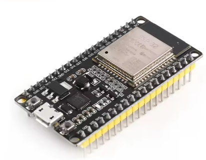
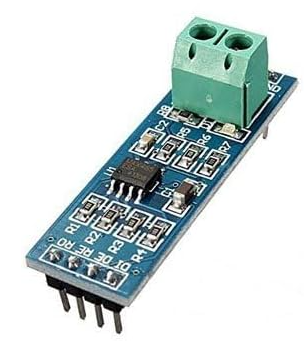
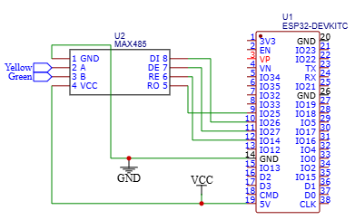

# Masai Vision 3000 - ESP32 Lingbo BMS Emulator / Gateway

ESP32-based firmware designed to reverse-engineer and emulate the original Lingbo BMS protocol of the **Masai Vision 3000** electric motorcycle over an RS485 bus. 

This project aims to allow the replacement of the stock BMS with an aftermarket solution (such as a **JK-BMS**) while keeping the original dashboard fully functional and free of error codes.

---

## 🚀 Features

* **RS485 Bus Sniffing & Emulation:** Intercepts dashboard queries and responds with correctly structured data frames.
* **Error Suppression:** Prevents the dashboard from displaying critical warning codes or the exclamation mark (`!`) when the stock BMS is removed.
* **Interactive Terminal Control:** Allows real-time simulation and modification of vehicle metrics via the USB serial monitor for testing purposes.
* **WiFi AP + Telnet Debug (optional):** When `TELNET_DEBUG = true`, RS485 frames are broadcast over Telnet (port 23) via a WiFi access point (`MasaiBMS_Logger`).
* **Passive Dump Mode (Sniffing):** Set `READ_FRAME_ONLY = true` in `src/main.cpp` to passively dump raw frames from both the original BMS and motorcycle over USB Serial and Telnet without transmitting or interfering on the RS485 bus.
* **Dynamic Parameters Handled:**
  * State of Charge (SoC) (`0x08`)
  * Operating Current / Discharge mapping (`0x07`)
  * Temperatures (`0x05`)
  * Charger presence / Status flags (`0x0C`)
  * Unknown registers under investigation (`0x0A`, `0x0B`)

---

## 🧩 Firmware

The project now uses a single firmware entry point: [`src/main.cpp`](src/main.cpp).

It handles BMS emulation and, when `READ_FRAME_ONLY = true`, passive RS485 frame dumping. In dump mode, it keeps the RS485 transceiver in receive mode and does not send BMS responses.

---

## 📡 Identified RS485 Protocol

Frames use the `86 12` header and end with `E0 F0`. The intermediate fields are still being reverse-engineered.

| Register | Role | Observed response format | Status |
|---:|---|---|---|
| `0x05` | Temperatures | `86 12 05 05 T1 T2 T3 T4 T5 CS1 CS2 E0 F0` | Temperatures are sent directly in °C. `CS1 CS2` matches the little-endian 16-bit sum of bytes 1–8 in the captures. |
| `0x07` | Current | `86 12 07 02 LL HH XX YY E0 F0` | `LL HH` is likely a signed little-endian current in tenths of an ampere. |
| `0x08` | State of charge | `86 12 08 01 SS CC 00 E0 F0` | `SS` is the SoC in %. Captures suggest `CC = SS + 0x1B`. |
| `0x0A` | **UNKNOWN** | `86 12 0A 02 LL HH CC 00 E0 F0` | Observed little-endian 16-bit value; role and unit are unknown. |
| `0x0B` | **UNKNOWN** | `86 12 0B 02 LL 08 CC 00 E0 F0` | Captures: `3C 08 63`, `20 08 47`, `1C 08 43`. `CC = LL + 0x27` in all three cases. |
| `0x0C` | Charge/discharge state | `86 12 0C 02 EE 00 CC 00 E0 F0` | `00` = idle, `01` = discharging, `02` = charging; `CC = EE + 0x20` observed. |

The checksum relationships above are derived from the available captures and require validation with additional measurements.

---

## 🛠️ Hardware Requirements

* **Microcontroller:** ESP32 (38-pin)



* **Transceiver:** MAX485 (RS485 to TTL module)



* **Connections:**
  * `RS485_RX_PIN` (GPIO25) → RO
  * `RS485_TX_PIN` (GPIO26) → DI
  * `DE_PIN` (GPIO27) → DE
  * `RE_PIN` (GPIO14) → RE

* **Schematic:**



> **Note:** ESP32 has 3 UARTs (UART0 = USB debug, UART1/UART2 = available). UART2 is used with GPIO25/GPIO26 remapped via `HardwareSerial::begin(9600, SERIAL_8N1, RX_PIN, TX_PIN)`. Do NOT use GPIO16 (RTC pin) for UART.


---

## 🔧 Build & Flash

### Prerequisites

* [PlatformIO](https://platformio.org/) (VS Code extension or CLI)
* ESP32 development board (38-pin)

### Commands

```bash
# Build
pio run

# Flash (close Serial Monitor first)
pio run -t upload

# Monitor
pio run -t monitor
```

### Telnet Debug (optional)

Set `TELNET_DEBUG = true` in `src/main.cpp`, then:

1. Connect to WiFi: `MasaiBMS_Logger` / `password123`
2. Telnet to `192.168.4.1` port `23`
3. RS485 frames appear in hex format

---

## 💻 Interactive Serial Commands

While connected to the serial monitor (115200 baud), you can use the following commands to override values in real time:

* `c[value]` : Toggle charging state (0 / 1)
* `t[value]` : Set temperature (e.g., `t25` for 25°C)
* `a[value]` : Set current in Amps (e.g., `a20` for 20A)
* `s[value]` : Set State of Charge percentage (e.g., `s80` for 80%)

---

## 📁 Project Structure

```
masai-vision-3000-bms-emulator/
├── .gitignore
├── platformio.ini                # PlatformIO project configuration (ESP32, Arduino)
├── README.md
├── src/
│   └── main.cpp                  # Main firmware entry point (BMS emulation + frame dumping)
├── include/
│   └── README                    # Header file directory (placeholder)
├── lib/
│   ├── README                    # Library directory placeholder
│   └── TelnetLogger/             # WiFi AP + Telnet server library
│       ├── TelnetLogger.h
│       └── TelnetLogger.cpp
├── docs/                         # Protocol reverse-engineering documentation
│   ├── 05_protocol_temperature.md
│   ├── 07_protocol_current.md
│   ├── 08_protocol_soc.md
│   ├── 0A_protocol_unknown.md
│   ├── 0B_protocol_unknown.md
│   └── 0C_protocol_charge_discharge_state.md
├── img/                          # Project images and schematics
│   └── Schematic_Rs485_esp32.png
└── test/
    └── README                    # Test directory placeholder
```

---

## 🚧 Status

* **Phase 1 (Current):** Protocol reverse-engineering, request-response handling, and serial terminal simulation. *(Completed)*
* **Phase 2 (Upcoming):** Integration with physical hardware (**JK-BMS** data parsing via Bluetooth/UART) to dynamically feed real battery telemetry to the dashboard.

---

## ⚠️ Disclaimer

This project is for educational, diagnostic, and custom vehicle modification purposes. Working with high-voltage electric vehicle battery systems involves severe risks. Use at your own risk.
